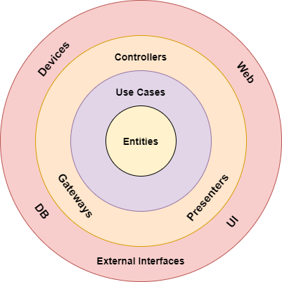
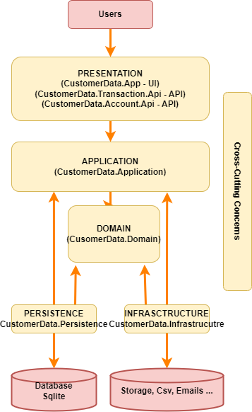

# Assignment implemented with the Clean architecture template
 
### Reference

* [Clean Architecture by Robert C. Martin (Uncle Bob)](https://blog.cleancoder.com/uncle-bob/2012/08/13/the-clean-architecture.html)

## About The Project

This project provides complete solution which is built on Clean Architecture with all essentia,  feature CI/CD, best practice, testing Strategy using .NET Core.

The solution for the assignment is created using the following architecture:

## Instructions

Open the solution in Visual Studio 2022. Set multiple running projects and select CustomerData.Transaction.Api and CustomerData.Account.Api.
The user interface is implemented in the project CustomerData.App.Mvc
Run multiple projects.
The swagger documentation api will open in the browser.
Inspect the database to find the userId, use the UserId to call the api to create the account or other apis.

The isntructions how to deploy to minikube can be found in my blog post:
https://commoncodetopics.blogspot.com/2022/12/deploy-your-programs-in-minikube-with.html

## Technology stack

Architecture Pattern

- [x] Clean architecture
- [x] (Includes)
    - [x] Screaming architecture-[Functional organisation design](http://blog.cleancoder.com/uncle-bob/2011/09/30/Screaming-Architecture.html)
    - [x] Onion archhitecture

Design Pattern
- [x] CQRS design pattern
- [ ] Decorator design pattern
- [x] Mediator design pattern
- [x] Repository design pattern
- [x] Unit of work 
- [x] Factory design pattern
 
Backend
- [x] Language: C#
- [x] Framework: dotnet core 6, ASP.NET Core

UI
- [ ] Blazor, Asp.NetCore Mvc

Database
- [x] SQLLite
- [x] DB Connectivity : Entityframework Core - Code First

Cloud server
- [x] MiniKube deployment files
- [x] Docker files

Service
- [x] Web API (Restful service)

Feature
- [x] Dataseeding
- [x] Custom Exceptionn Handler
- [x] Automapper
- [x] Fluent validation
- [x] Serilog
- [x] Swagger UI
- [x] API Versioning
- [x] Mailkit (Mail service)

Testing
- [x] Unit testing (Nunit)

CI/CD
- [ ] Docker images 

## Licence Used

See the contents of the LICENSE file for details

